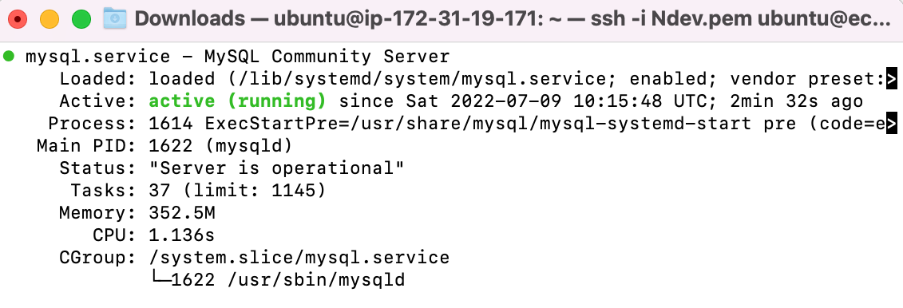
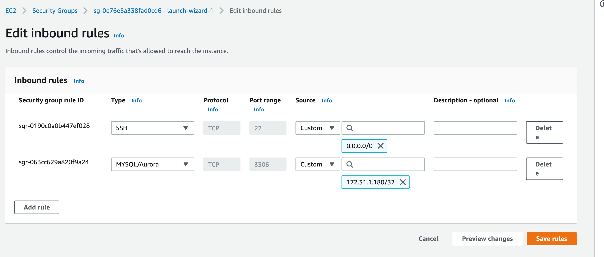
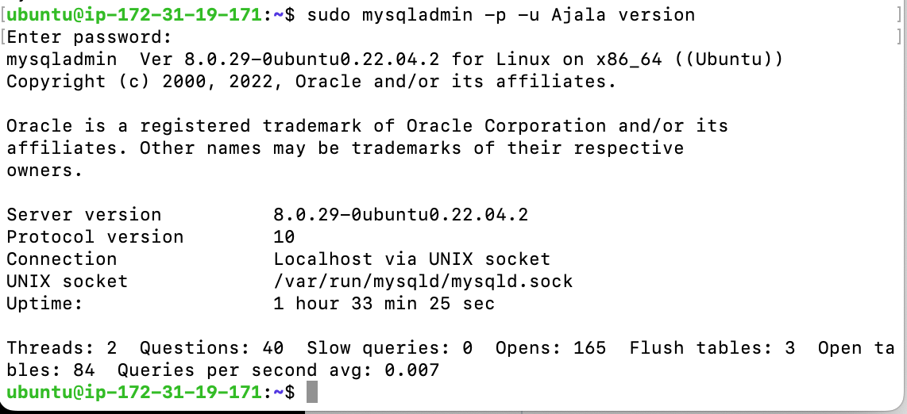
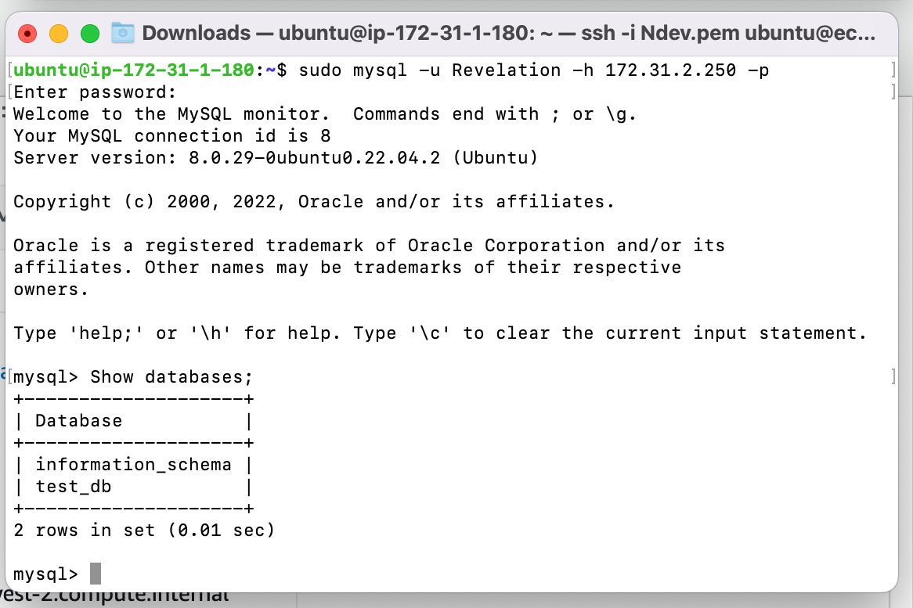

# A CLIENT SERVER ARCHITECTURE USING MYSQL DATABASE MANAGEMENT SYSTEM (DBMS).

Created and configured two Linux-based virtual servers (EC2 instances in AWS).
- mysql-server and
- mysql-client

### Installation of MySQL Server Software On the MySQL Server Instance

```
sudo apt update -y
```
```
sudo apt install mysql-server -y
```

Enabled mysql service with the command below

```
sudo systemctl enable mysql
```

The command below was used to check the server status

```
sudo systemctl status mysql.service
```



*The image above shows the server satus of the mysql*

### Installation of MySQL client Software On the MySQL client Instance

```
sudo apt update -y
```

```
sudo apt install mysql-client -y
```
### Created a new entry in 'Inbound rules' in 'mysql server' Security Groups.
- Note: for extra security, do not allow all IP addresses to reach the 'mysql server' rather allow access only to the specific local IP address of the 'mysql client'. see the image below;



Next

Running a security script on mysql-server terminal to remove some insecure default settings

Using Validate set up
```
ALTER USER 'root'@'localhost' IDENTIFIED WITH mysql_native_password BY 'PassWord.1';
```

```
sudo mysql_secure_installation
```

Then after the password was changed

Logged into the mysql console using the root user

```
mysql -u root -p
```

Another user was created on the mysql-server with the command below:

```
CREATE USER 'Revelation'@'%' IDENTIFIED WITH mysql_native_passsword BY 'password';
```
NOTE
- *the 'password' indicated was changed to a strong password to comply with the password policy.*


```
CREATE DATABASE test_db;
```

```
 GRANT ALL ON test_db.* To 'Revelation'@'%'  WITH GRANT OPTION;
 ```

```
FLUSH PRIVILEGES;
```
```
exit
```

### Configured MySQL server to allow connections from remote hosts, by replacing the bind-address from ‘127.0.0.1’ to ‘0.0.0.0’ 

```
sudo vi /etc/mysql/mysql.conf.d/mysqld.cnf
```
To validate the changes 
```
sudo systemctl  restart mysql
```


Test the mysql instance using the new user:

sudo mysqladmin -p -u Ajala version



NEXT

Connected remotely to mysql server Database Engine from mysql client. 



*the image above shows that we have successfully connected to a remote MySQL server and can perform SQL queries:*